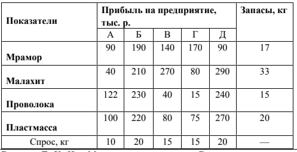

# Computer-modeling-labs
Laboratory works for descipline: Database
### Задание №5. 
> [!NOTE]
> Объединение “Труд” получило на год следующие материалы — малахит, мрамор,
проволоку и пластмассу. Требуется распределить эти материалы между пятью
предприятиями таким образом, чтобы общая прибыль от их переработки была
максимальной. Величина прибыли от переработки, запасы и потребности приведены в
таблице. Указание. В качестве расходов на транспортировку
С_i_j
взять разность между
величиной максимальной прибыли в таблице и прибылью в соответствующей клетке
таблицы. Как осуществить перевозки с минимумом затрат? Для составления опорного
плана использовать метод наименьшей стоимости.
> 
